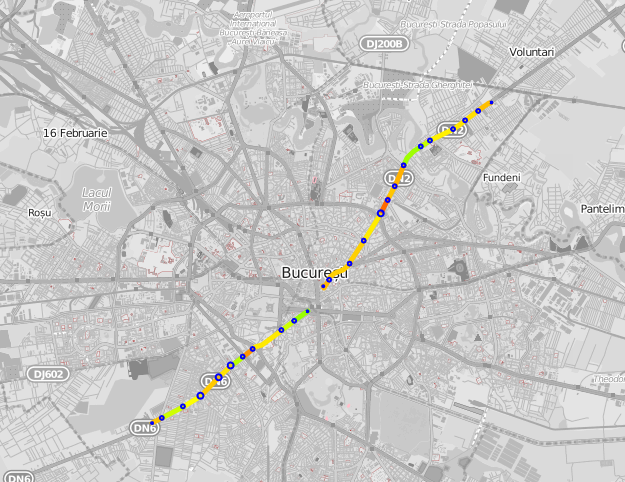

# jstransit
jstransit uses [Leaflet](http://leafletjs.com/) to display public transport relations ([v2](http://wiki.openstreetmap.org/wiki/Proposed_features/Public_Transport)) from Openstreetmap using the [Overpass API](http://wiki.openstreetmap.org/wiki/Overpass_API). 
If you time a certain PT route, you can use jstransit to display the speed for each segment and various other statistics.

# Examples
See several examples in the examples folder:
- [multiple.html](examples/multiple.html) displays several public transport relations in Bucharest, Romania;
- [examples timings](examples/trip_timing) display statistics for trips made with Bus 117 in Bucharest in October 2016;
- [route.html](examples/route.html) lets you choose a PT relation and a timing file from [examples/timings](examples/timings) to display statistics for the trip;
- [routes.html](examples/routes.html) same as above, and you can also display multiple routes, see the fifth screenshot below; there is also a button to clear the map.

# TODO
- document timing format (but you have some examples)
- add route tooltip
- document other stuff
- add ability to clear map in routes.html

# Screenshots

